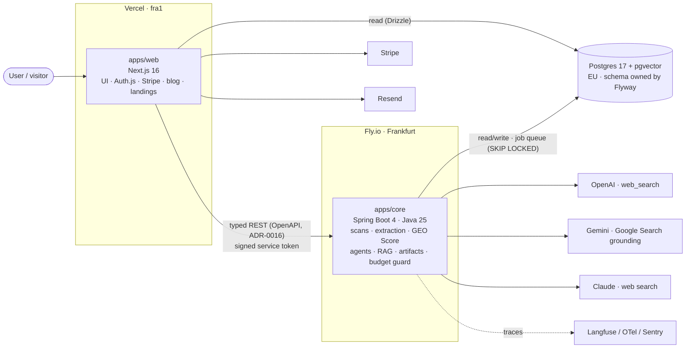

# GEOMASTER — Architecture overview

Two deployables in one monorepo: `apps/web` (Next.js on Vercel) owns UI, auth, billing and content; `apps/core` (Java 25 + Spring Boot 4 on Fly.io) owns the domain. They share Postgres (schema owned by core), an OpenAPI contract and the plan limits file. Details in `docs/adr/`.



## Boundaries

| Rule | Why |
| --- | --- |
| Only `apps/core` calls LLM providers | One place for cost tracking, budget guard and model portability (ADR-0007) |
| Only Flyway in `apps/core` changes the schema | One owner, no migration conflicts (ADR-0005) |
| `apps/core` never renders HTML | Keeps Lighthouse and i18n concerns in web (ADR-0002, ADR-0003) |
| Plan limits only in `packages/plans/plans.json` | Single source of truth (FR-BIL-03, ADR-0010) |
| API changes regenerate `packages/api-contract` in the same PR | Contract drift fails CI (ADR-0016) |

## Repository layout

```
apps/web              Next.js app (UI, auth, billing, blog, landings, free tool UI)
apps/core             Spring Boot service (domain, jobs, providers, RAG)
packages/plans        Plan limits (JSON + TS helpers; Java reads the JSON)
packages/api-contract OpenAPI document + generated TS types
packages/i18n         UI strings in EN, DE, FR, ES
packages/ui           Design tokens and shared components (after the design phase)
docs/                 PRD snapshot, ADRs, this overview
specs/                Spec Driven Development (requirements, design, tasks per feature)
```
